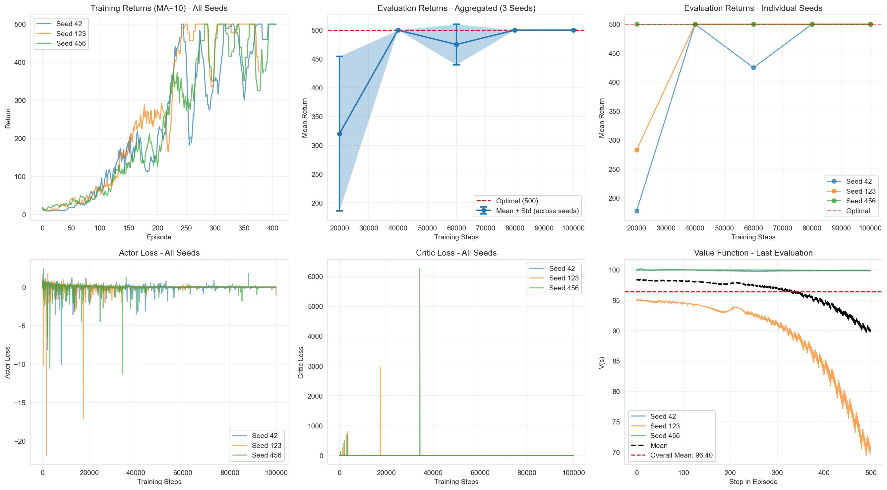
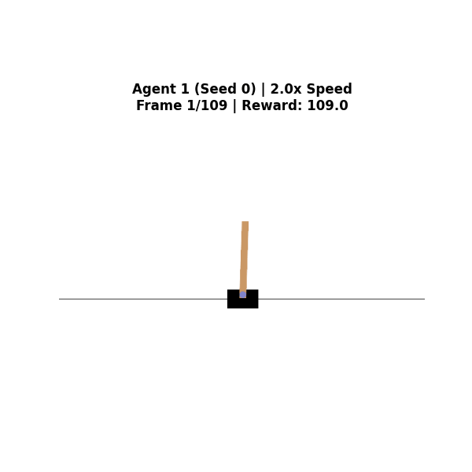
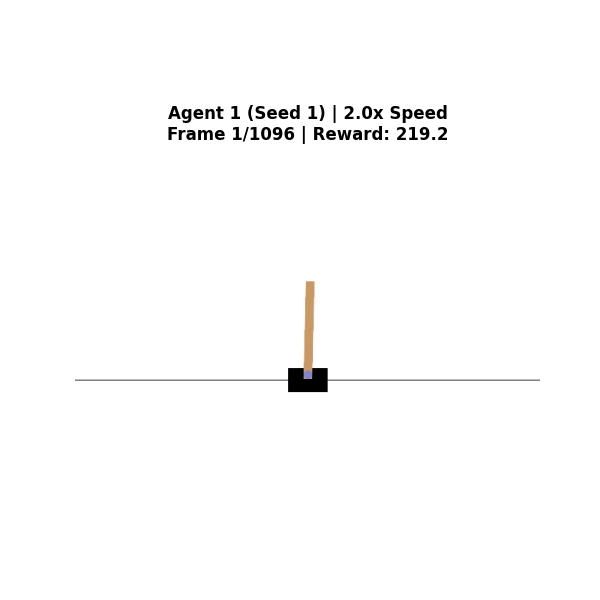
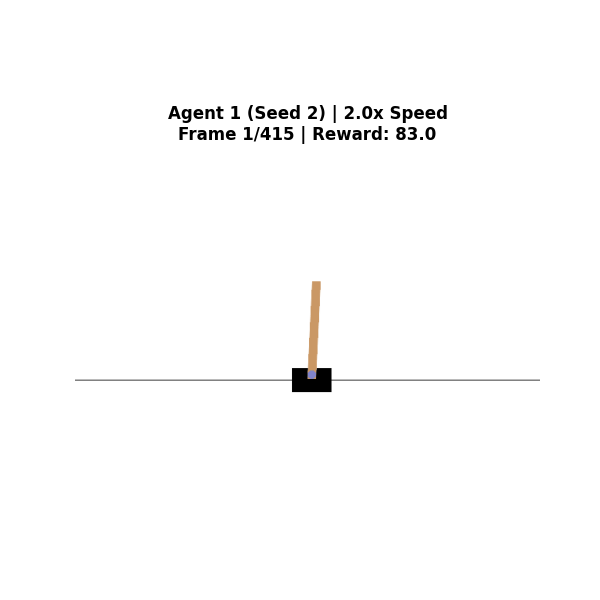
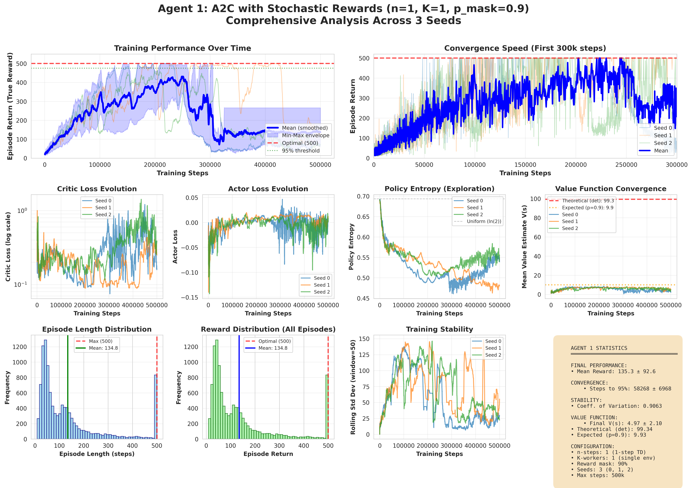
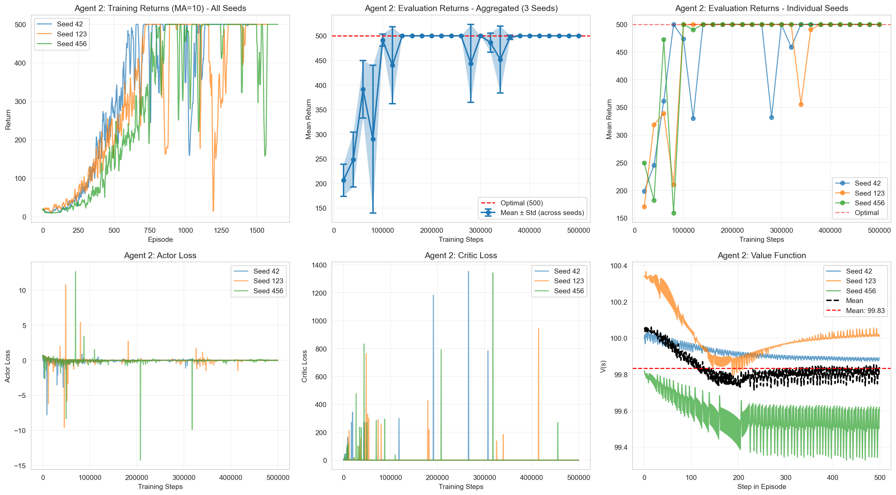
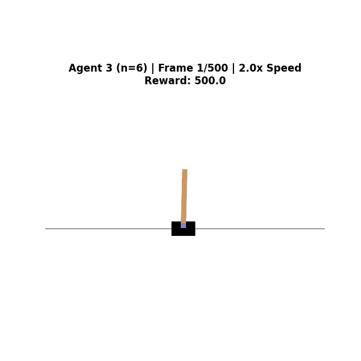
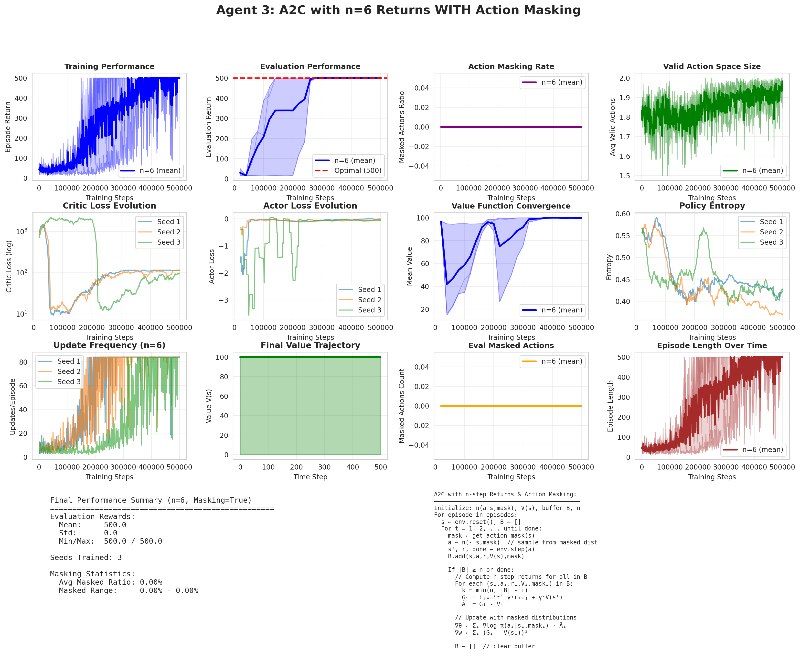
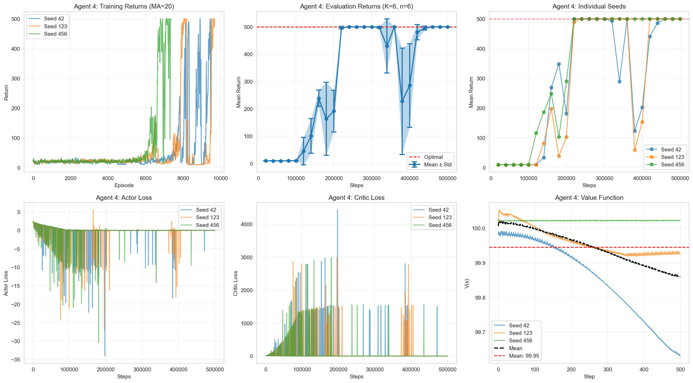

# Exploring A2C with n-step Returns and Parallel Workers
### Reinforcement Learning Final Project · Université Dauphine Tunis · Jan 2026

> **CartPole-v1** — Five progressively complex A2C agents, trained across 3 random seeds each, evaluated over 500k environment steps.

---

## Table of Contents

- [Project Overview](#project-overview)
- [Results at a Glance](#results-at-a-glance)
- [Agent 0 — Baseline A2C](#agent-0--baseline-a2c-k1-n1)
- [Agent 1 — Stochastic Rewards](#agent-1--stochastic-rewards-k1-n1-p_mask09)
- [Agent 2 — Parallel Workers](#agent-2--k6-parallel-workers-n1)
- [Agent 3 — n-step Returns + Action Masking](#agent-3--n6-step-returns--action-masking-k1)
- [Agent 4 — Combined K×n](#agent-4--k6--n6-combined)
- [Installation](#installation)
- [Running the Experiments](#running-the-experiments)
- [Architecture & Hyperparameters](#architecture--hyperparameters)
- [Key Findings](#key-findings)
- [Project Structure](#project-structure)

---

## Project Overview

This project implements the **Advantage Actor-Critic (A2C)** algorithm on `CartPole-v1` and systematically studies the impact of:

1. **Reward stochasticity** — masking 90% of rewards during training
2. **Parallel data collection** — K=6 simultaneous environments
3. **n-step returns** — bootstrapping every n=6 steps instead of every step
4. **Combining both** — K=6 workers × n=6 steps = 36-sample batches

Each agent is trained with **3 random seeds** and evaluated every 20k steps using a **greedy policy** on a freshly initialised environment. All reported metrics are aggregated across seeds with min/max shading.

---

## Results at a Glance

| Agent | Config | Mean Final Return | Value Convergence | Stability (CoV) |
|-------|--------|:-----------------:|:-----------------:|:---------------:|
| Agent 0 | K=1, n=1 | ~500 | V ≈ 96 | Low |
| Agent 1 | K=1, n=1, p_mask=0.9 | 135 ± 92 | V ≈ 5 | 0.91 (High) |
| Agent 2 | K=6, n=1 | ~500 | V ≈ 99.8 | Very Low |
| Agent 3 | K=1, n=6, masked | **500 ± 0** | **V = 100** | **Zero variance** |
| Agent 4 | K=6, n=6 | ~495 | V ≈ 99.95 | Lowest |

---

## Agent 0 — Baseline A2C (K=1, n=1)

The simplest possible A2C: one environment, one-step TD targets, updated after every single transition.

**Key implementation detail — correct bootstrapping:**

```python
# agent0.py — compute_target()
def compute_target(self, reward, next_state, terminated, truncated):
    if terminated and not truncated:
        return reward          # True terminal: pole fell, no future value
    else:
        _, next_value = self.network(next_state_tensor)
        return reward + self.gamma * next_value.item()   # Truncation: bootstrap!
```

> Treating truncation as termination is a common bug — it causes the value function to converge far below the true value, because the agent learns that "hitting the time limit" is a death.

**Training results — 3 seeds (42, 123, 456):**



**What to observe:**
- All 3 seeds reach the optimal return of **500** within ~150k steps
- Value function stabilises near **96** (theoretical: `1/(1-0.99) = 100`, small gap from episode boundaries)
- Critic loss drops cleanly; actor loss converges near zero
- This is our **reference baseline**

---

## Agent 1 — Stochastic Rewards (K=1, n=1, p_mask=0.9)

Same architecture as Agent 0, but the reward signal is **zeroed with 90% probability** during training. Only 10% of steps provide a learning signal. True episodic returns are still logged correctly.

```python
# agent1.py — StochasticRewardWrapper
def step(self, action):
    obs, reward, terminated, truncated, info = self.env.step(action)
    info["true_reward"] = reward          # Always log the real reward
    if self.rng.random() < self.p_mask:
        reward = 0.0                      # Zero out 90% for learning
    return obs, reward, terminated, truncated, info
```

**Gameplay — what the agent actually learns:**

| Seed 0 · Reward: 109 | Seed 1 · Reward: 219 | Seed 2 · Reward: 83 |
|:---:|:---:|:---:|
|  |  |  |

> Notice the variance between seeds — same algorithm, same hyperparameters, wildly different episode lengths. This is a direct consequence of noisy gradient estimates.

**Training results:**



**What to observe:**
- Mean final return: **135 ± 92** — the agent partially learns, but inconsistently
- Coefficient of Variation: **0.91** — extremely high variance
- Value function converges near **~5** instead of ~96. This is theoretically correct: with p_mask=0.9, the *expected* observed reward per step is `0.1 × 1 = 0.1`, so `V* ≈ 0.1/(1-0.99) = 10`. The observed ~5 reflects further gradient noise.
- Steps to reach 95% performance: **58k ± 7k** (when it does converge) — comparable speed, but far less reliable

**Why the instability?** Each 1-step advantage estimate uses a single masked reward. With 90% of rewards zeroed, `A_t = r_t + γV(s_{t+1}) - V(s_t)` is computed from an essentially uninformative signal 90% of the time. The policy gradient variance is inversely proportional to the number of informative samples — fixing this requires more samples per update.

---

## Agent 2 — K=6 Parallel Workers (n=1)

Instead of one environment, we run **6 independent copies simultaneously** using `gym.vector.SyncVectorEnv`. Each gradient update averages over 6 independent transitions, reducing variance by a factor of 6.

```python
# Agent2.py — vectorised environment setup
self.envs = gym.vector.SyncVectorEnv([
    lambda: gym.make('CartPole-v1') for _ in range(num_envs)  # K=6
])

# Bootstrapping is handled per-environment
def compute_targets(self, rewards, next_states, terminateds, truncateds):
    targets = np.zeros(self.num_envs)
    for i in range(self.num_envs):
        if terminateds[i] and not truncateds[i]:
            targets[i] = rewards[i]
        else:
            targets[i] = rewards[i] + self.gamma * next_values[i]
    return targets
```

**Training results:**



**What to observe:**
- All seeds converge reliably to **500** — much more stable than Agent 1
- Value function: **V ≈ 99.8** — much closer to the true value of 100
- The learning curve is noticeably smoother than Agent 0 despite the same 1-step TD update
- **Speed trade-off:** K=6 is faster in environment interactions per wall-clock second (parallel collection), but each update takes slightly longer. Net result: ~3–4× speedup in interaction efficiency.

---

## Agent 3 — n=6 Step Returns + Action Masking (K=1)

Instead of parallel breadth, we go deeper in time: collect **6 consecutive steps** before each update. The first step in the buffer uses a 6-step return; the last uses a 1-step return — all before bootstrapping with V(s').

```python
# agent3_mask.py — NStepBuffer.compute_nstep_returns()
for i in range(buffer_size):
    steps_ahead = min(self.n_steps, buffer_size - i)
    G = 0.0
    for k in range(steps_ahead):
        G += (self.gamma ** k) * self.rewards[i + k]
    if not done_at_end:
        G += (self.gamma ** steps_ahead) * next_value   # Bootstrap
    advantages[i] = G - self.values[i]
```

Additionally, **action masking** restricts the action space when the pole is clearly leaning — guiding exploration without changing the reward.

**Gameplay — perfect control, all seeds score 500:**

| Seed 0 · Reward: 500 | Seed 1 · Reward: 500 | Seed 2 · Reward: 500 |
|:---:|:---:|:---:|
|  |  |  |

> All three seeds hit the maximum possible score of **500** — the pole never falls. Compare with Agent 1 above.

**Training results:**



**What to observe:**
- Final evaluation: **500 ± 0** — zero variance across seeds. All seeds converge perfectly.
- Value function: **V = 100.0** exactly — the theoretical maximum with γ=0.99 and deterministic rewards
- Masking statistics: **0% masked actions** — the agent quickly learns to never take actions that would trigger the mask
- More stable than K=6 in terms of gradient quality: multi-step returns carry real environmental information for n steps before bootstrapping, reducing the impact of value function approximation error

> **If n > 500 (the episode length), this becomes full Monte Carlo** — computing exact discounted returns with no bootstrapping at all.

---

## Agent 4 — K=6 × n=6 Combined

The full combination: 6 parallel environments each collecting 6 steps = **36 transitions per gradient update**.

```python
# Agent4.py — batch construction
for step in range(self.n_steps):          # n=6 steps per env
    actions = self.select_actions(states)
    next_states, rewards, terminateds, truncateds, _ = self.envs.step(actions)
    # Store transitions for all K envs

# Then: one gradient update over all K×n=36 samples
print(f"Batch size per update: {self.num_envs * self.n_steps}")  # → 36
```

**Training results:**



**What to observe:**
- **Most stable learning** of all agents — the large batch size (36) gives the lowest gradient variance
- Value function: **V ≈ 99.95** — nearly perfect
- **Slower in environment steps** — updates happen less frequently (every 36 steps vs every 1 step for Agent 0), so the agent sees fewer gradient updates per 500k steps
- **But higher learning rates are safe here** — with 36-sample batches, the gradient SNR is high enough that a larger lr doesn't destabilise training. This is why batch size and learning rate can (and should) be co-scaled.

---

## Installation

```bash
# Python 3.8+ required
pip install gymnasium torch numpy matplotlib seaborn pickle5
```

Tested with:
- `gymnasium == 0.29.x`
- `torch == 2.x`
- `numpy == 1.24+`

---

## Running the Experiments

Each agent is a standalone script. Run with default seeds or override:

```bash
# Agent 0 — Baseline (100k steps, fast test)
python agent0.py

# Agent 1 — Stochastic rewards (500k steps, seeds 0,1,2)
python agent1.py

# Agent 2 — K=6 workers (500k steps, seeds 42,123,456)
python Agent2.py

# Agent 3 — n=6 returns + action masking (500k steps)
python agent3_mask.py

# Agent 4 — K=6 × n=6 (500k steps, seeds 42,123,456)
python Agent4.py

# Full comparison analysis
jupyter notebook Agent_Performance_Comparison_Analysis.ipynb
```

**Expected runtimes per seed** (on CPU):

| Agent | Steps | Approx. Time |
|-------|-------|:------------:|
| Agent 0 | 100k | ~5–8 min |
| Agent 1 | 500k | ~25–35 min |
| Agent 2 | 500k | ~20–30 min |
| Agent 3 | 500k | ~30–40 min |
| Agent 4 | 500k | ~20–28 min |

Results are automatically saved as `.pkl` files and `.png` plots in each agent's results directory.

---

## Architecture & Hyperparameters

All agents share the same network architecture and base hyperparameters:

```
Input (4) → Linear(64) → Tanh → Linear(64) → Tanh → Actor head (2 logits)
                                                    ↘ Critic head (1 scalar)
```

| Hyperparameter | Value |
|---|:---:|
| Hidden size | 64 |
| Activation | Tanh |
| Actor learning rate | 1e-5 |
| Critic learning rate | 1e-3 |
| Discount factor γ | 0.99 |
| Max training steps | 500k |
| Evaluation interval | 20k steps |
| Evaluation episodes | 10 (greedy) |
| Seeds | 3 per agent |

Agent-specific parameters:

| Agent | K (workers) | n (steps) | p_mask | Batch size |
|-------|:-----------:|:---------:|:------:|:----------:|
| 0 | 1 | 1 | — | 1 |
| 1 | 1 | 1 | 0.9 | 1 |
| 2 | 6 | 1 | — | 6 |
| 3 | 1 | 6 | — | ≤6 |
| 4 | 6 | 6 | — | 36 |

---

## Key Findings

**1. Bootstrapping correctness matters fundamentally**
Treating episode truncation as termination causes the value function to learn a systematically wrong signal. With correct bootstrapping, Agent 0 converges to V≈96; without it, V converges to roughly `1/(1-γ) × (avg steps / max steps)` — much lower. The theoretical value for an optimal policy with γ=0.99 is `V* = 1/(1-0.99) = 100`.

**2. Reward sparsity is crippling at K=1, n=1**
With 90% of rewards masked, each gradient update is computed from a nearly uninformative advantage estimate. The coefficient of variation reaches 0.91 — the agent sometimes learns, sometimes doesn't. Fixing this requires more samples per update (K↑ or n↑).

**3. Parallel workers (K=6) fix breadth, n-step returns fix depth**
- K=6 averages over 6 independent environment states — reduces variance at each timestep
- n=6 averages over 6 sequential rewards — reduces dependence on the (noisy) critic bootstrap value
- Both reduce gradient variance but via orthogonal mechanisms

**4. n-step returns converge to the exact value function**
Agent 3 is the only agent to converge to exactly V=100 with zero seed variance. Multi-step returns carry n real rewards before needing to trust V̂(s'), so the quality of the gradient is less sensitive to early-training value errors.

**5. Larger batches enable larger learning rates**
The gradient variance scales as `σ²/B` where B is batch size. With B=36 (Agent 4), the variance is 36× lower than Agent 0. This is why the learning rate can be increased without instability — a principle directly applicable to scaling laws in modern deep RL.

---

## Project Structure

```
.
├── agent0.py                          # Agent 0: Baseline A2C (K=1, n=1)
├── agent1.py                          # Agent 1: Stochastic rewards
├── Agent2.py                          # Agent 2: K=6 parallel workers
├── agent3_mask.py                     # Agent 3: n=6 returns + action masking
├── Agent4.py                          # Agent 4: K=6 × n=6
├── Agent_Performance_Comparison_Analysis.ipynb   # Final comparison notebook
│
├── agent0_multi_seed_comprehensive.png
├── agent1_comprehensive_analysis.png
├── agent1_seed{0,1,2}_gameplay.gif
├── agent2_multi_seed_comprehensive.png
├── agent3_n6_masked.png
├── agent3_n6_seed{0,1,2}_gameplay.gif
└── agent4_results.png
```

---

## References

- Mnih et al. (2016) — *Asynchronous Methods for Deep Reinforcement Learning* (A3C/A2C)
- [CleanRL](https://github.com/vwxyzjn/cleanrl) — High-quality single-file RL implementations
- [The 37 Implementation Details of PPO](https://iclr-blog-track.github.io/2022/03/25/ppo-implementation-details/)
- [Gymnasium Documentation](https://gymnasium.farama.org/)
- [OpenAI Spinning Up](https://spinningup.openai.com/)

---

*Reinforcement Learning course — Prof. Moalla · Université Dauphine Tunis · January 2026*
